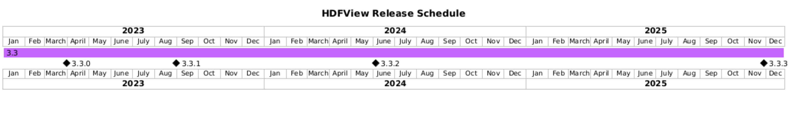

HDFView version 3.3.3 currently under development

The HDF Group is the developer, maintainer, and steward of HDFView. Find more
information about The HDF Group, the HDFView Community, and other HDF software projects,
tools, and services at [The HDF Group's website](https://www.hdfgroup.org/). 

HELP AND SUPPORT
----------------
Information regarding Help Desk and Support services is available at

   https://help.hdfgroup.org/

FORUM and NEWS
--------------
The [HDF Forum](https://forum.hdfgroup.org) is provided for public announcements and discussions
of interest to the general HDFView Community.

   - News and Announcements
   https://forum.hdfgroup.org/c/news-and-announcements-from-the-hdf-group

   - HDFView (and Java) Topics
   https://forum.hdfgroup.org/c/hdfview-java-hdf-object-package

These forums are provided as an open and public service for searching and reading.
Posting requires completing a simple registration and allows one to join in the
conversation.  Please read the [instructions](https://forum.hdfgroup.org/t/quickstart-guide-welcome-to-the-new-hdf-forum
) pertaining to the Forum's use and configuration.

RELEASE SCHEDULE
----------------

 

HDFView releases at least once a year, usually in the spring after the HDF4
release. Future HDFView releases indicated on this schedule are tentative.

**NOTE**: All HDFView releases are now based on the latest maintenance releases
of HDF5 and HDF4. Previous releases of HDFView that were based on HDF5 1.8,
1.10, and 1.12 (e.g. 3.1.x, 3.2.x) have been retired.

| Release | HDF5 | HDF4 | New Features |
| ------- | ---- | ---- | ------------ |
| 3.3.0 | 1.14.0 | 4.2.16 | HDF5 1.12 (new-style) references, Single-Writer/Multiple-Readers (SWMR) reads, bug fixes |
| 3.3.1 | 1.14.2 | 4.2.16-2 | Fixes a critical HDF4 + HDFView bug |
| 3.3.2 | 1.14.4 | 4.3.0 | Float16 support |
| 3.4.0 | 2.0.0 | 4.4.0 | Complex number support |

PREVIOUS RELEASES AND SOURCE CODE
--------------------------------------------
Source packages for current and previous releases are located at:
    
   https://support.hdfgroup.org/downloads/

Development code is available at our Github location:
    
   https://github.com/HDFGroup/hdfview.git

